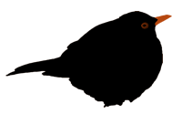

#Blackbird

Blackbird provides easy-to-use proxy objects that let you call methods
across event based transports such as websockets, iframe postMessage channel
etc. Instead of manually emitting and listening to events, blackbird lets
you define interfaces that you can implement on one end point. On the
other end point a proxy object is generated that you can call just as if
it had been a local object. Any message based communication channel can
be used so only your imagination sets the limit.

##Why?
Without blackbird the code for requesting data from one endpoint to the other could look something like this:

    // Endpoint A
    var name;
    window.addEventListener('message', function(e) {
      name = e.data;
      console.log(name);
    });
    
    window.postMessage('getName', '*');
    
    // Endpoint B
    window.addEventListener('message', function(e) {
      window.postMessage('Paul', '*');
    });

This is not very generic and very error prone.
Now compare it with the following blackbird code:

    // Endpoint A
    outbound.getName(function(err, name){
      console.log(name);
    });

    // Endpoint B
    inbound.getName = function(){
      return Paul;
    }

blackbird abstracts away the underlying messaging and lets you concentrate
on your application logic instead. If you prefer promises over callback
blackbird supports that too out of the box.

    // Endpoint A
    outbound.getName().then(function(name){
      console.log(name);
    });

    // Endpoint B
    inbound.getName = function(){
      return Paul;
    }

Blackbird can be used in node, in the browser per script tag and as an AMD
module.

Follow [@AronKornhall](http://twitter.com/AronKornhall) for news and updates
regarding this library.

##Example (iframe postMessage)
###Embedding iframe
The embedding iframe exposes a method getName

    // Define a transport
    var transport = blackbird.transports.iframe(window.parent);

    // Inbound interface (will be called from remote)
    var inbound = {
      getName: function(){
        return 'Paul';
      }
    };

    // Setup blackbird
    blackbird(inbound, {}, transport);

###Embedded iframe
The embedded iframe calls getName on embedding iframe

    var iframe = document.getElementById('iframe');

    // Define transport
    var transport = blackbird.transports.iframe(iframe.contentWindow);

    // Outbound interface (will be proxied to remote end)
    var outbound = {
      getName: function(){ }
    };

    // Setup blackbird
    blackbird({}, outbound, transport);

    // Call getName on remote
    outbound.getName(function(err, name){
      alert(name);
    });

For a complete running example see `examples/iframe/index.html`

##Install
Node

    npm install blackbird

Browser

    bower install blackbird
    or download blackbird.js

##Test
    npm test

##Reference

    blackbird(inbound, outbound, transport)

Setup blackbird with the inbound interface `inbound`, outbount interface `outbound`
and transport `transport`.

__Arguments__
 
    inbound   {Object} inbound interface containing method implementations that will
              be called by remote endpoint
 
    outbound  {Object} outbound interface with functions that will be called on remote
              endpoint. The functions shouldn't be implemented, only defined
 
    transport {Object} transport interface that should implement the following functions:
        send(data)
            data {String} the data to be sent to the remote endpoint
        listen(fn)
            fn {Function} registers fn as a listener for remote messages. fn accepts
                          a single {String} as input parameter

---------

    blackbird.transports.iframe(targetWindow, sourceWindow, domain)

Shorthand for creating an iframe transport from `sourceWindow` to
`targetWindow`. `domain` is a domain mask that can be used to limit to
which domains messages can be sent.

__Arguments__
 
    targetWindow   {Object} the window to which we should send outgoing messages. To send messages to an embedded iframe use iframe.contentWindow (where iframe is the dom iframe element). To send data to the embedding (host) window of an embedded iframe as a target, use window.parent
 
    sourceWindow   {Object} the window on which we should listen for incoming messages. Defaults to the global window.
 
    domain  {String} the domain mask. Can be used to limit to which domains messages are sent. Defaults to '*' meaning any domain.

##License 

(The MIT License)

Copyright (c) 2014 Aron Kornhall <aron@optimalbits.com>

Permission is hereby granted, free of charge, to any person obtaining
a copy of this software and associated documentation files (the
'Software'), to deal in the Software without restriction, including
without limitation the rights to use, copy, modify, merge, publish,
distribute, sublicense, and/or sell copies of the Software, and to
permit persons to whom the Software is furnished to do so, subject to
the following conditions:

The above copyright notice and this permission notice shall be
included in all copies or substantial portions of the Software.

THE SOFTWARE IS PROVIDED 'AS IS', WITHOUT WARRANTY OF ANY KIND,
EXPRESS OR IMPLIED, INCLUDING BUT NOT LIMITED TO THE WARRANTIES OF
MERCHANTABILITY, FITNESS FOR A PARTICULAR PURPOSE AND NONINFRINGEMENT.
IN NO EVENT SHALL THE AUTHORS OR COPYRIGHT HOLDERS BE LIABLE FOR ANY
CLAIM, DAMAGES OR OTHER LIABILITY, WHETHER IN AN ACTION OF CONTRACT,
TORT OR OTHERWISE, ARISING FROM, OUT OF OR IN CONNECTION WITH THE
SOFTWARE OR THE USE OR OTHER DEALINGS IN THE SOFTWARE.
